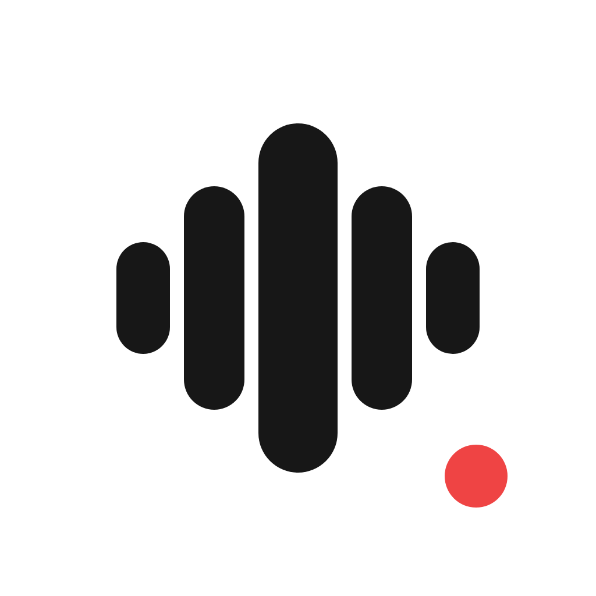

<h1 align="center"> UnTypo</h1>

  按住快捷键说话，松开后，文字回到你刚才正在输入的地方

  
  
  

UnTypo 是一个仍在早期开发中的 Windows 听写工具。它把语音转成文字，再按口述内容完成润色、翻译或指令生成。

## 你可以用 UnTypo 做什么

### 在聊天、写作或填表时，少说多做

- 在任意应用里用快捷键开始听写；
- 设置口述语言和默认翻译目标语言；
- 模型会把口述内容按普通转写、翻译请求或内容指令等模式进行处理，并把结果输入到原来的光标位置。

### 让模型少把专有名词听错

- 把人名、产品名或专业术语加进词典，它们会作为转写提示发送给模型；
- 为不同的模型提供商保存多个模型配置；
- 可选姓名、称呼和签名，让指令式生成更贴近你的个人习惯。

### 想留下记录时留得住，不想留时也关得掉

- 历史记录保存在本机，可查看、复制或一键清空；
- 可完全关闭记录功能，或设置保存的天数。

## 本地优先

- UnTypo 不提供账号、同步或中转服务器；配置、词典和历史记录都保存在当前电脑上；
- 历史记录使用本地 SQLite 数据库；
- API Key 和个人资料经系统安全加密后才会存储到本地，我们当中的任何人都不能直接读取它们；
- **录音、转写文本和词典提示仍会发送到你配置的模型服务提供商**，因为 UnTypo 的服务需要由这些供应商处理。
